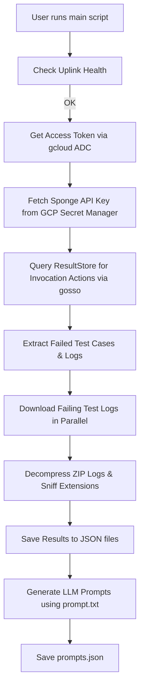

# Sponge Failure Analyzer & Prompt Generator

This module provides a suite of automated Python scripts to help Android Studio developers pull test results, download failure logs, and generate structured LLM prompts to quickly diagnose and fix broken tests (especially journey or integration tests after an IntelliJ platform merge).

The entry point script is `analyze_sponge_data.py`. It automatically fetches execution status and failure data from Sponge/ResultStore, downloads relevant logs in parallel, and generates a structured prompt array that can be used directly with LLMs (like Gemini) to debug the failure.

---

## Workflow Overview



1. **Main Script (`analyze_sponge_data.py`)** orchestrates the process:
   - Verifies local **Uplink** health using **`auth_utils.py`**.
   - Obtains Application Default Credentials (ADC) using **`auth_utils.py`**.
   - Uses **`get_gcp_secret.py`** to download the Sponge API key from GCP Secret Manager.
   - Calls the ResultStore API via the **`gosso`** command to pull target/action status.
   - Routes test cases into passed/failed lists.
   - Downloads the failed logs in parallel using **`download_sponge_artifact.py`** and unpacks them.
   - Saves the results as structured JSONs.
   - Runs **`generate_prompt.py`** to format and inject this context into **`prompt.txt`** and saves `prompts.json`.

---

## Setup & Prerequisites (For Mac Developers)

Since this tool accesses secure internal Google corporate services and APIs, you must run it with specific environment configurations on your Mac.

### 1. Uplink
Because you are accessing corp-only APIs (such as `resultstoredownload.corp.googleapis.com` and `secretmanager.googleapis.com`), you **must** have **Uplink** running on your Mac.
- Ensure your Uplink client is active. By default, the script validates Uplink's health at `http://127.0.0.1:999/healthz`.
- If Uplink is not running or is unhealthy, the script will safely exit with an error.

### 2. Google Cloud SDK (`gcloud`)
The script fetches a GCP access token to read Secrets.
- Install the Google Cloud CLI on your Mac (e.g., via Homebrew or manual install).
- Authenticate with Application Default Credentials:
  ```bash
  gcloud auth application-default login
  ```

> [!NOTE]
> **Proxy & SSL Certificate Resolution (Mac-friendly):**
> Mac workstations often run local corporate proxies or have custom SSL root configurations that cause `gcloud` to throw certificate verification errors (`SSL: CERTIFICATE_VERIFY_FAILED`).
> The script automatically scrubs all corporate proxy/SSL environment variables (`HTTP_PROXY`, `REQUESTS_CA_BUNDLE`, etc.) only during the `gcloud` invocation so it prints the token reliably without issues.

### 3. Internal CLI Utilities (`gosso`)
The script utilizes the `gosso` command to perform authenticated HTTP requests.
- Make sure `gosso` is installed on your Mac and is available in your `PATH` (usually in `/usr/local/bin` or `/opt/homebrew/bin`).

### 4. Python Dependencies
The scripts are written in Python 3 and utilize standard library modules (such as `urllib.request`). No external pip dependencies are required.

---

## Usage

Run the main script using your Python 3 interpreter, passing the Sponge Invocation ID (UUID) as a positional argument:

```bash
python3 tools/adt/idea/automation/sponge-scripts/analyze_sponge_data.py <INVOCATION_ID>
```

### Command Line Arguments

| Argument | Description | Default |
|---|---|---|
| `invocation_id` | **(Required)** The Sponge Invocation ID (UUID) representing the run. | N/A |
| `--output-dir` | A custom base output directory to save logs and JSON results. | `~/Downloads/studio-test-artifacts` |
| `--gcp-project` | Google Cloud Project containing the Sponge API key secret. | `android-studio-test-automation` |
| `--secret-name` | GCP Secret Manager secret ID for the API key. | `studio-sponge-api-key` |
| `--use-default-loas-project` | Use default LOAS project for authentication instead of fetching an API key via `gcloud`. | `False` |
| `--verbose` | Enable verbose debug logging to console. | `False` |

### Environment Variables

The script will also honor the following environment variables:
- `STUDIO_ARTIFACT_DIR`: Configures the default output directory (overridden by `--output-dir`).
- `STUDIO_GCP_PROJECT`: Configures the default GCP project containing the secret.
- `STUDIO_SPONGE_SECRET_NAME`: Configures the default secret name.

---

## Output Directory Structure

Once execution completes, the files are saved under the resolved directory (e.g., `~/Downloads/studio-test-artifacts/<INVOCATION_ID>/`):

```text
~/Downloads/studio-test-artifacts/<INVOCATION_ID>/
├── passed_test_results.json              # Metadata for passed test cases
├── failed_test_results.json              # Metadata for failed test cases
├── prompts.json                          # LLM prompts composed from failing tests/logs
├── grouped_failures.txt                  # Automatically generated grouped failures report
└── <CleanTargetName>_<CleanActionName>/  # Subfolder per failed action
    ├── test.log                          # Extracted primary log file
    └── logs/                             # Unzipped subdirectory containing logs
        ├── idea.log                      # IDE diagnostic logs
        └── emu0_stderr.txt               # Emulator logs (if applicable)
```

### Using the Generated Prompts
Open `prompts.json` and copy the prompt text for the specific failing target. The prompt is pre-formatted in Markdown, highlighting:
- The target name.
- Which specific tests inside it failed.
- The exact local paths of downloaded logs.
You can paste this directly into Gemini or your favorite IDE chat window to assist in resolving the failure!

### Analyzing the Grouped Failures
Open `grouped_failures.txt` to see a summary of all failures grouped by their probable root cause signature. This allows you to immediately identify if a single underlying issue (like an emulator timeout or database conflict) caused a massive cascade of failing tests.

---

## Querying & Filtering Failures Locally

Once you have downloaded the failure data (which produces `failed_test_results.json`), you can use `parse_failures.py` to quickly query, filter, and inspect the failures from the command line without opening massive JSON files.

### Usage

You can run `parse_failures.py` by pointing it to a local JSON file or by providing the Invocation ID (which will look up the file in your default artifacts directory).

```bash
# Query using a direct JSON path
python3 tools/adt/idea/automation/sponge-scripts/parse_failures.py --json-path ~/Downloads/studio-test-artifacts/<INVOCATION_ID>/failed_test_results.json

# Query by Invocation ID (auto-resolves path)
python3 tools/adt/idea/automation/sponge-scripts/parse_failures.py --invocation-id <INVOCATION_ID>
```

### Filtering Options

You can filter the output using regex on various fields:

```bash
# Filter by target name
python3 tools/adt/idea/automation/sponge-scripts/parse_failures.py -i <INVOCATION_ID> --target "SantaTracker"

# Filter by test class name
python3 tools/adt/idea/automation/sponge-scripts/parse_failures.py -i <INVOCATION_ID> --class "BenchmarkTest"

# Filter by test method name
python3 tools/adt/idea/automation/sponge-scripts/parse_failures.py -i <INVOCATION_ID> --method "testStartup"

# Filter by failure message content
python3 tools/adt/idea/automation/sponge-scripts/parse_failures.py -i <INVOCATION_ID> --message "TimeoutException"
```

### Output Options

By default, the script does not print details to console. Instead, it **always saves the report to a file** in the same directory as the input JSON (e.g., under `~/Downloads/studio-test-artifacts/<INVOCATION_ID>/`). You can override the output path using the `--output` / `-o` flag.

```bash
# Save an aggregated summary to failure_summary.txt
python3 tools/adt/idea/automation/sponge-scripts/parse_failures.py -i <INVOCATION_ID> --summary

# Save grouped failures by root cause to grouped_failures.txt
python3 tools/adt/idea/automation/sponge-scripts/parse_failures.py -i <INVOCATION_ID> --group

# Save full stack traces (including verbose stack traces) to failure_details_limit_20.txt
python3 tools/adt/idea/automation/sponge-scripts/parse_failures.py -i <INVOCATION_ID> --verbose

# Limit the number of detailed failures and save to failure_details_limit_5.txt
python3 tools/adt/idea/automation/sponge-scripts/parse_failures.py -i <INVOCATION_ID> --limit 5

# Save the report to a custom path
python3 tools/adt/idea/automation/sponge-scripts/parse_failures.py -i <INVOCATION_ID> --group --output ~/Desktop/my_report.txt
```

---

## Detailed Script Directory Reference

### [analyze_sponge_data.py](analyze_sponge_data.py)
The central orchestrator. Coordinates authentication, queries the API, routes passed/failed targets, triggers downloading, and spawns the prompt generator.

### [auth_utils.py](auth_utils.py)
Handles secure extraction of the gcloud ADC token and checks the local Uplink daemon health. Includes robust logic to scrub local corporate proxies temporarily to prevent SSL handshaking errors on Mac systems.

### [download_sponge_artifact.py](download_sponge_artifact.py)
Handles downloading artifacts over standard Google REST APIs.
- Converts raw `bytestream://` URIs to standard media URLs.
- Performs **content sniffing** (magic byte verification) to correctly discover file extensions if headers are absent.
- Implements secure **Zip Slip prevention** checks during unpacking.

### [get_gcp_secret.py](get_gcp_secret.py)
Uses the GCP Secret Manager REST API to safely fetch and base64-decode the Sponge API key.

### [generate_prompt.py](generate_prompt.py)
Extracts failing test classes, test names, and corresponding local log files from the failure JSON, and uses `prompt.txt` to build structured debugging instructions for an AI.

### [prompt.txt](prompt.txt)
A markdown prompt template containing placeholders for dynamic failure details.

### [parse_failures.py](parse_failures.py)
A powerful command-line utility to filter, summarize, and inspect failures from the downloaded `failed_test_results.json`. Supports regex filtering by target, class, method, and error message, and offers truncated stack trace previews.

### [skill.md](skill.md)
Agent skill documentation providing metadata and usage instructions for AI assistants.
